# Web应用漏洞攻防

## 实验环境

- Webgoat
- Juice Shop
- Kali

## 实验内容

### 环境搭建

通过已有的ctf-games迅速搭建环境,在`ctf-games/owasp/webgoat`和`ctf-games/owasp/juice-shop`目录下使用`docker-compose up -d`成功搭建两个实验平台

使用`docker ps`查看平台地址端口信息：

Webgoat：

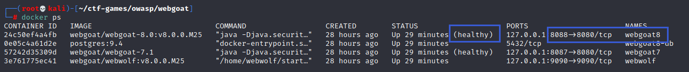

Juice Shop：

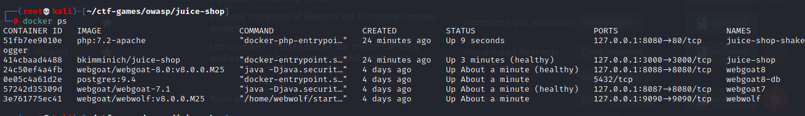

### WebGoat

- Parameter Tampering 未验证的用户输⼊ 

在Webgoat 8.0中找到任务入口：

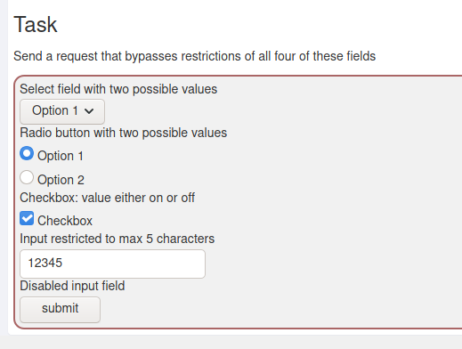

直接提交，显示错误

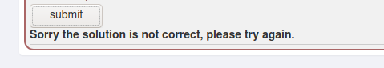

启用Burp Suite抓包，再次提交，截获表单内容信息，我们修改每一个表单项的内容，再次forward

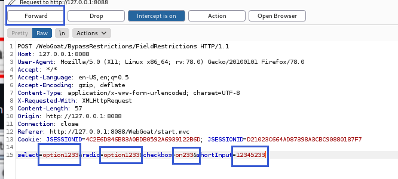

回到webgoat，显示提交成功

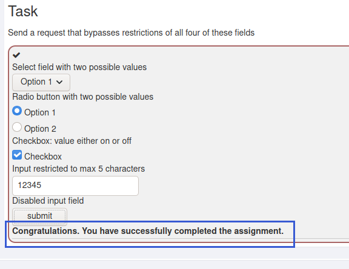

- Stored XSS Attacks 跨站点脚本(XSS) 

漏洞利用原理：

nsert html to that requests credentials 请求凭据 Add javascript to actually collect the credentials Post the credentials to http://localhost:8080/WebGoat/catcher?PROPERTY=yes...

标题和正文栏内输入`` 强行破解

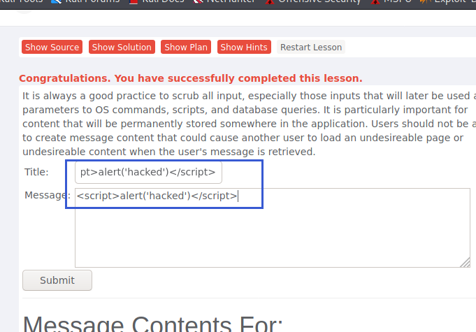

显示成功：

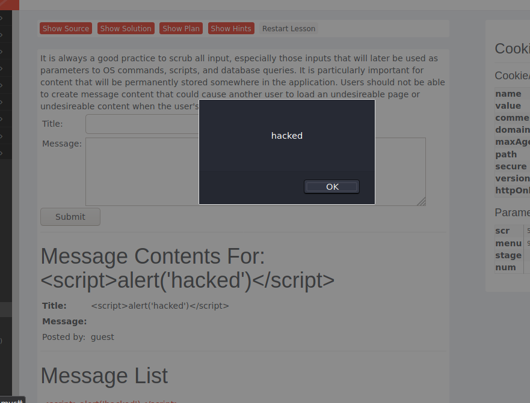

- Forgot Password

通过暴力破解：

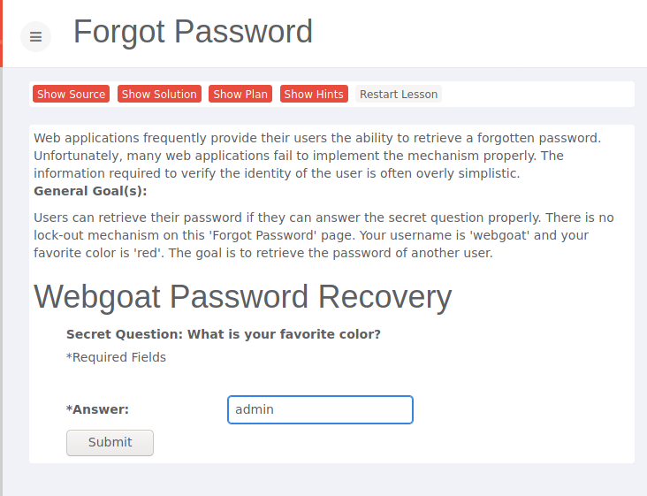

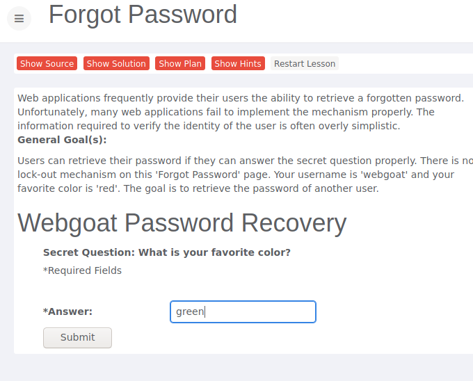

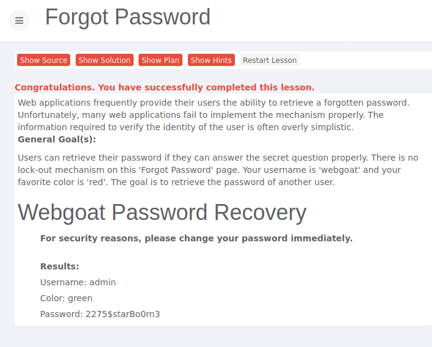

- Multi Level Login 2

先根据提示填入相应账号密码：

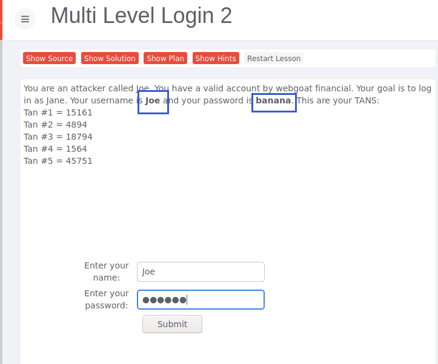

登陆后需要输入交易码，用开发人员工具将隐藏框内的Joe改为Jane，输入交易码后提交数据

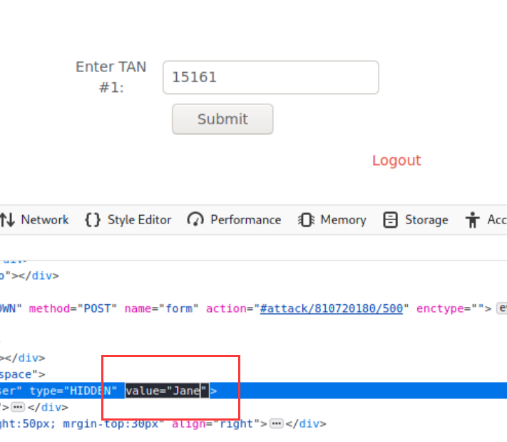

成功登录Jane的账号

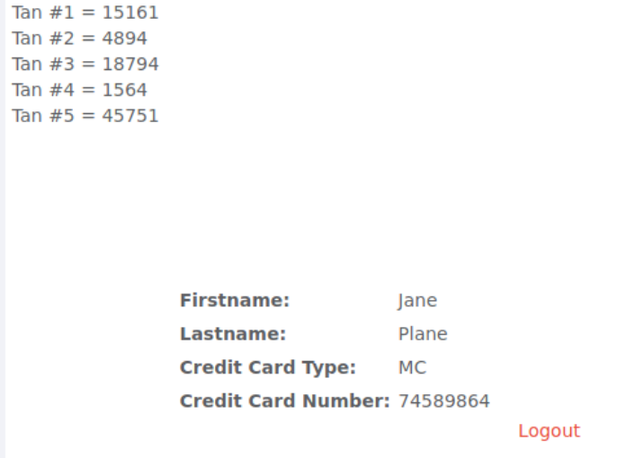

- Session Fixation

伪造一个带有Session的链接发送给别人,在邮件内容后附加SID

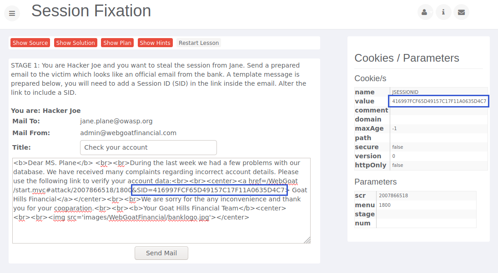

Jane收到邮件，点击链接并输入密码tarzan，进行登录

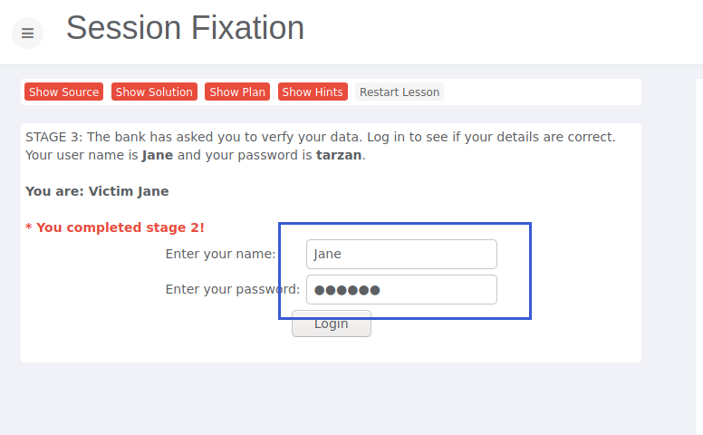

此时Joe不知道Jane的密码，只需要用刚刚发送的Session值,刷新界面，就可以直接进入Jane账户

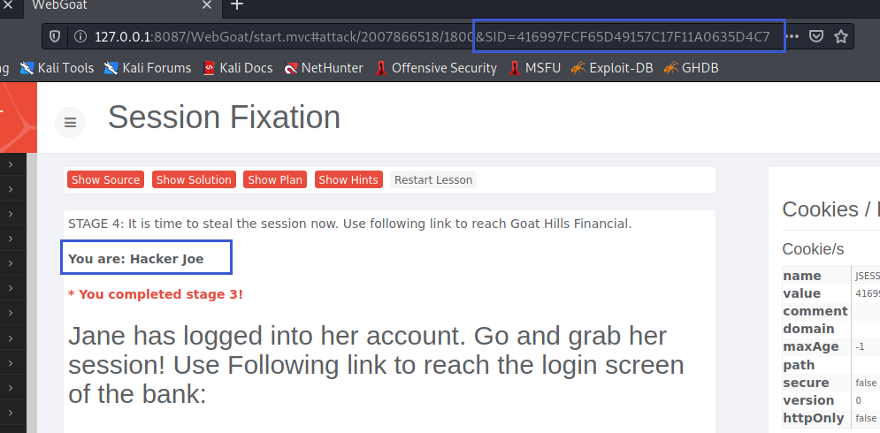

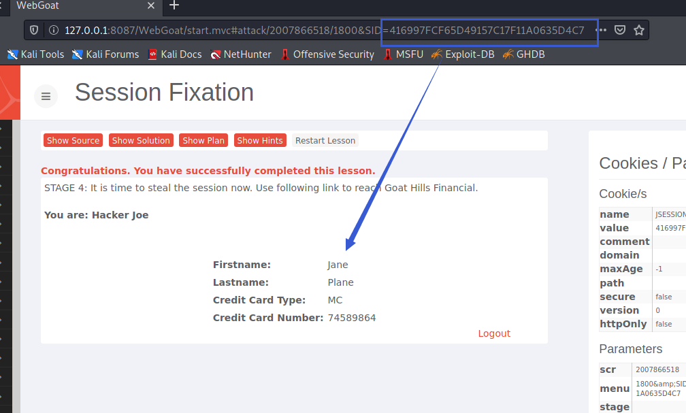

### Juice Shop

- 寻找计分板

查看mainxxx.js

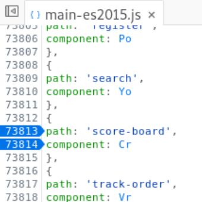

地址栏输入`127.0.0.1:3000/#/score-board`:

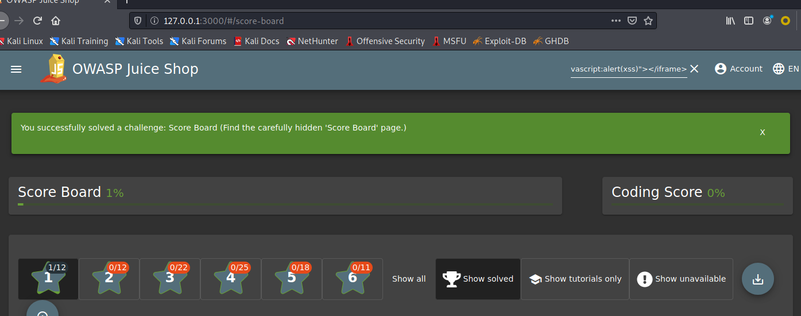

- DOM XSS

通过在输入框输入 `<iframe src="javascript:alert(xss)"></iframe>`:

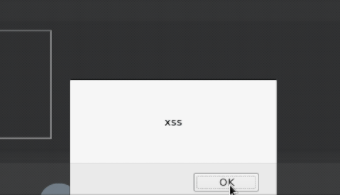

触发xss弹框，攻击成功

- SQL 注入攻击

在用户名部分输入`'or 1=1--`，密码随意填写即可绕过登录:

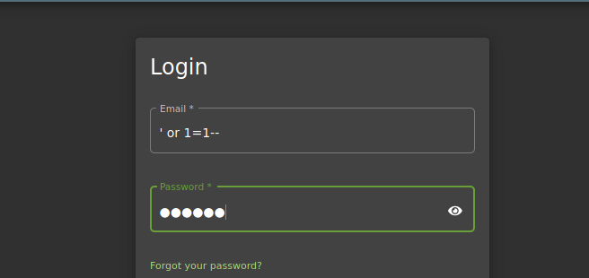

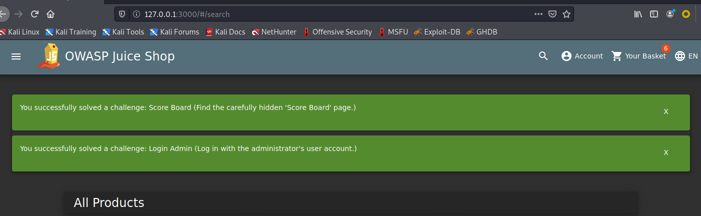

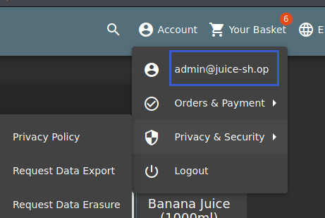

- 脆弱认证

通过忘记密码页面，寻找更改用户密码的机会

输入Bjoern的owasp账户，密保问题是问最喜欢的宠物。

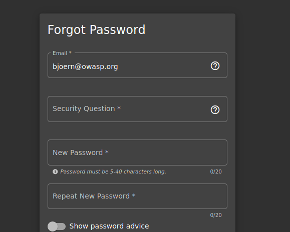

查找他的社交软件和人际关系，得知他有一只名叫Zaya的猫

通过这一点成功修改密码

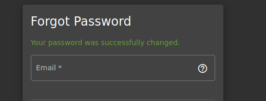

- 访问敏感数据

在`127.0.0.1:3000/ftp`地址下尝试浏览机密文件的目录

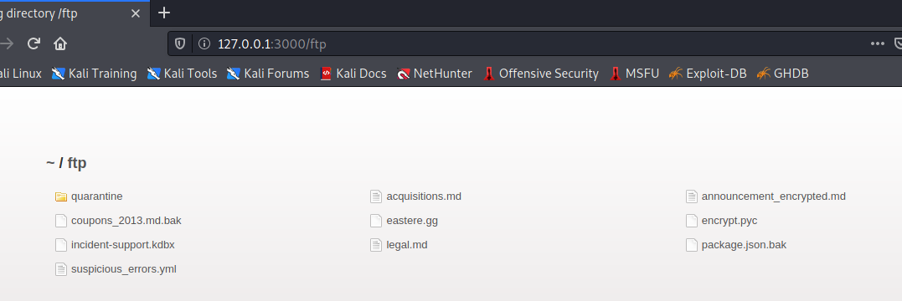

页面上的有些文件可以下载并，如：

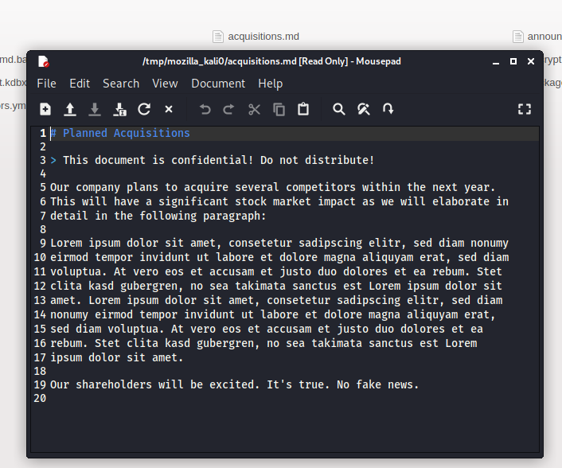

但有些不行，例如，点击conpous_2013.md.bak，显示只能由.pdf、.md格式打开

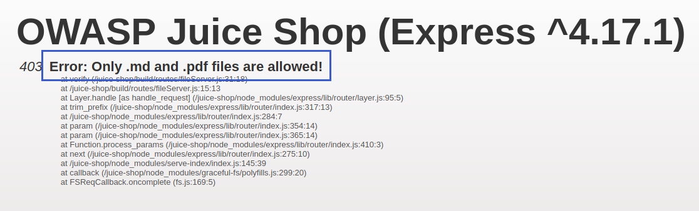

我们通过在地址后加入%2500.md暴力破解

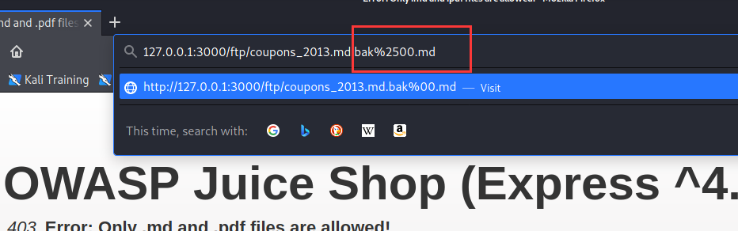

重新载入后得以下载文件

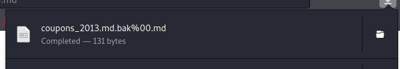

完成此任务

- 访问控制失效

正常情况下，添加商品到购物车后，购物车商品数会＋1

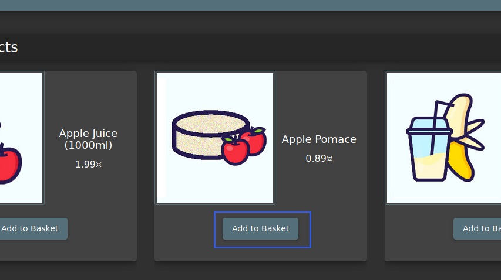

我们先启用Burp Suite抓包，再将物品加入购物车

在Burp Suite中查看，发现GET包链接上有个/rest/basket/1

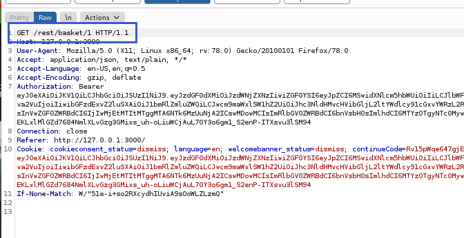

将1修改为其他数字，即可将商品加入其他用户的购物车中

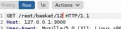

实验成功：

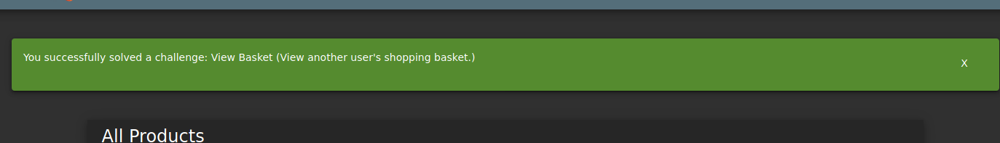

### 参考资料

- [BurpSuite使用](https://blog.csdn.net/weixin_38079422/article/details/80729158)