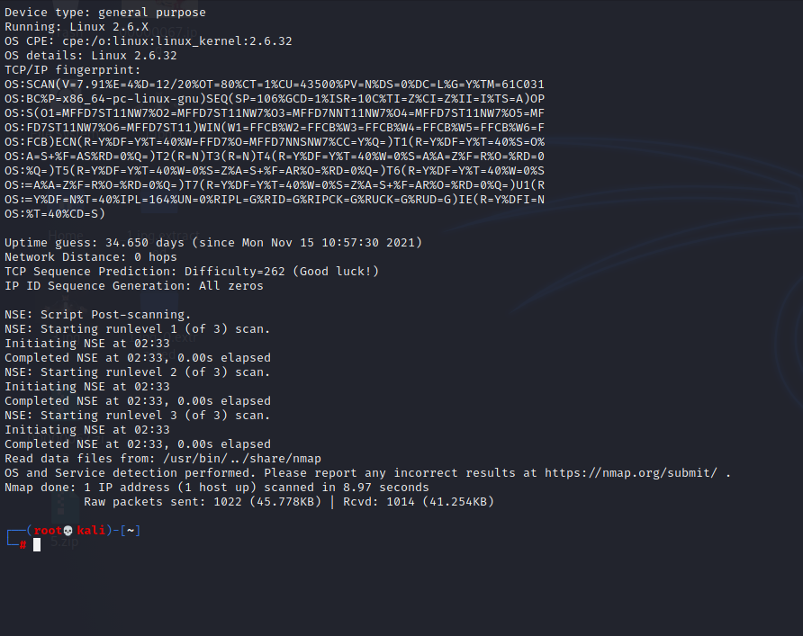

# 入侵检测

## 实验目的

进行入侵检测的软件实现体验，以sort工具为主

## 实验要求

通过配置sort不同规则来进行网络入侵检测

## 实验环境

两台互通的Kali主机

Sort工具

## 实验内容

网络拓扑：


检查攻击者和受害者连通性


### 实验一：配置snort为嗅探模式 

安装snort：

```bash
  export DEBIAN_FRONTEND=noninteractive #禁止在apt安装时弹出交互式配置界面

  apt install snort
```


配置snort为嗅探模式：

```bash
  # 显示IP/TCP/UDP/ICMP头
  snort –v
  
  # 显示应用层数据
  snort -vd
  
  # 显示数据链路层报文头
  snort -vde
  
  # -b 参数表示报文存储格式为 tcpdump 格式文件
  # -q 静默操作，不显示版本欢迎信息和初始化信息
  snort -q -v -b -i eth1 "port not 22"
  
  # 使用 CTRL-C 退出嗅探模式
  # 嗅探到的数据包会保存在 /var/log/snort/snort.log.<epoch timestamp>
  # 其中<epoch timestamp>为抓包开始时间的UNIX Epoch Time格式串
  # 可以通过命令 date -d @<epoch timestamp> 转换时间为人类可读格式
  # exampel: date -d @1511870195 转换时间为人类可读格式
  # 上述命令用tshark等价实现如下：
  tshark -i eth1 -f "port not 22" -w 1_tshark.pcap
```

使用主机ping网站，查看ICMP头


显示应用层和数据链路层的数据：


保存嗅探的数据 `snort -q -v -b -i eth0 "port not 22"`

```bash
  # 使用 CTRL-C 退出嗅探模式
  # 嗅探到的数据包会保存在 /var/log/snort/snort.log.<epoch timestamp>
  # 其中<epoch timestamp>为抓包开始时间的UNIX Epoch Time格式串
  # 可以通过命令 date -d @<epoch timestamp> 转换时间为人类可读格式
  # exampel: date -d @1511870195 转换时间为人类可读格式
  # -b 参数表示报文存储格式为 tcpdump 格式文件
  # 上述命令用tshark等价实现如下：
  tshark -i eth1 -f "port not 22" -w 1_tshark.pcap
```


获取数据包后可以对其进行入侵分析

### 实验二：配置snort的内置规则并启用

```bash
# /etc/snort/snort.conf 中的 HOME_NET 和 EXTERNAL_NET 需要正确定义
# 例如，学习实验目的，可以将上述两个变量值均设置为 any
snort -q -A console -b -i eth1 -c /etc/snort/snort.conf -l /var/log/snort/
```


### 实验三：自定义snort规则

```bash
# 新建自定义 snort 规则文件
cat << EOF > /etc/snort/rules/cnss.rules

#INSERT
alert tcp \$EXTERNAL_NET any -> \$HTTP_SERVERS 80 (msg:"Access Violation has been detected on /etc/passwd ";flags: A+; content:"/etc/passwd"; nocase;sid:1000001; rev:1;)
alert tcp \$EXTERNAL_NET any -> \$HTTP_SERVERS 80 (msg:"Possible too many connections toward my http server"; threshold:type threshold, track by_src, count 100, seconds 2; classtype:attempted-dos; sid:1000002; rev:1;)
EOF

# 添加配置代码到 /etc/snort/snort.conf
include $RULE_PATH/cnss.rules
```

创建自定义规则文件：


配置文档中加入规则文件路径：


```bash
# 开启apache2
service apache2 start

#应用规则开启嗅探
snort -q -A fast -b -i eth0 -c /etc/snort/snort.conf -l /var/log/snort/

# 在attacker上使用ab命令进行压力测试
ab -c 100 -n 10000 http://$dst_ip/hello
```

### 实验四：和防火墙联动

下载并解压[Guardian-1.7.tar.gz](https://c4pr1c3.gitee.io/cuc-ns/chap0x09/attach/guardian.tar.gz)

```bash
# 解压缩 Guardian-1.7.tar.gz
tar zxf guardian.tar.gz

# 安装 Guardian 的依赖 lib
apt install libperl4-corelibs-perl
```


在受害者机上开启Snort和guardian.pl

```bash
# 开启 snort
snort -q -A fast -b -i eth1 -c /etc/snort/snort.conf -l /var/log/snort/
```

```bash
# 假设 guardian.tar.gz 解压缩后文件均在 /home/kali/Desktop/guardian 下
cd /home/kali/Desktop/guardian
```

```bash
# 编辑guardian.conf并保存，更改参数
HostIpAddr 172.16.111.124
Interface eth0
```

```bash
# 启动 guardian.pl
perl guardian.pl -c guardian.conf
```


攻击者使用nmap暴力扫描受害者机：`nmap 172.16.111.124 -A -T4 -n -vv`

扫描结果：




### 课后问题

IDS与防火墙的联动防御方式相比IPS方式防御存在哪些缺陷？是否存在相比较而言的优势？

- 入侵检测系统（IDS）和入侵防御系统（IPS）都是网络基础架构的一部分。IDS / IPS将网络数据包与包含已知网络攻击签名的网络威胁数据库进行比较-并标记任何匹配的数据包。
- IDS偏向于检测，属于管理系统，会检测出不安全的网络行为，但是不阻断任何网络行为。IPS偏向于防御，属于控制系统，可以阻止危险行为。