# 实验-网络安全基础

## 建立拓扑

如图建立拓扑：

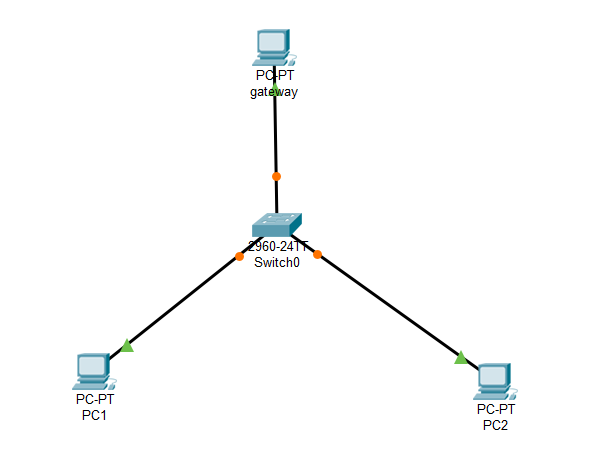

### 建立过程

VB配置网关的四块网卡及主机网络管理：

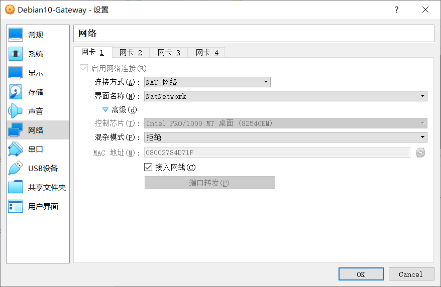

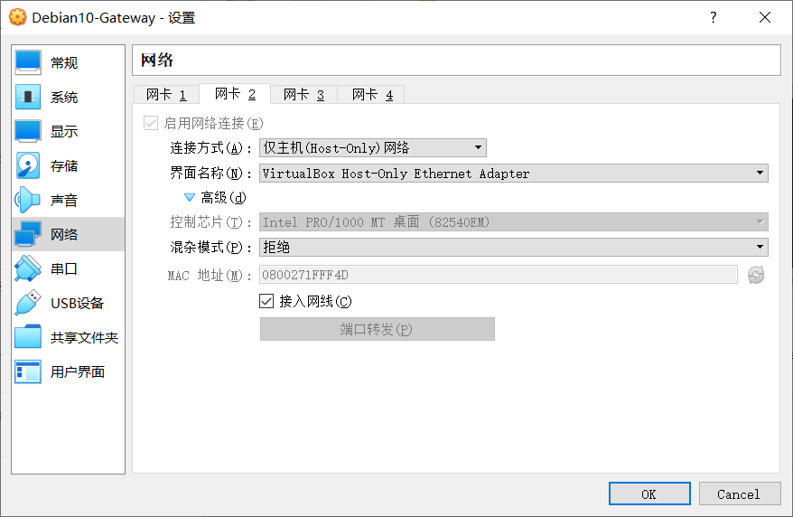

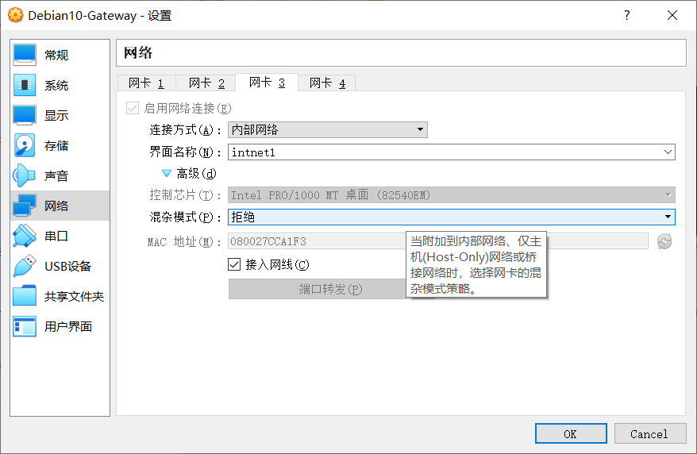

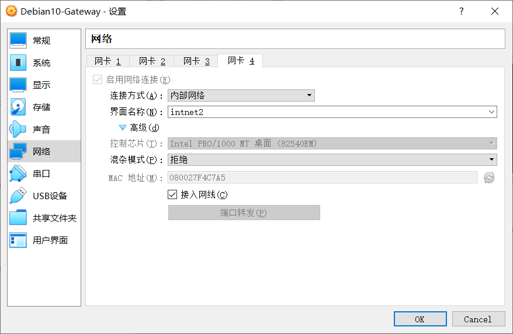

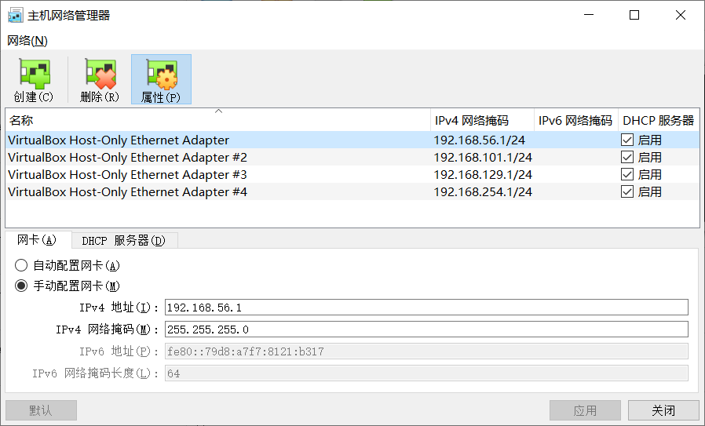

su切换至管理者权限，自动给intnet1、2分配地址：

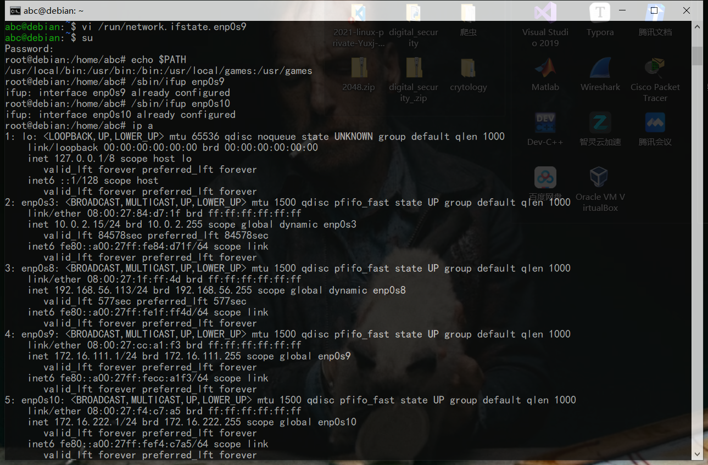

Windows XP系统关闭防火墙，否则网关无法与之连接：

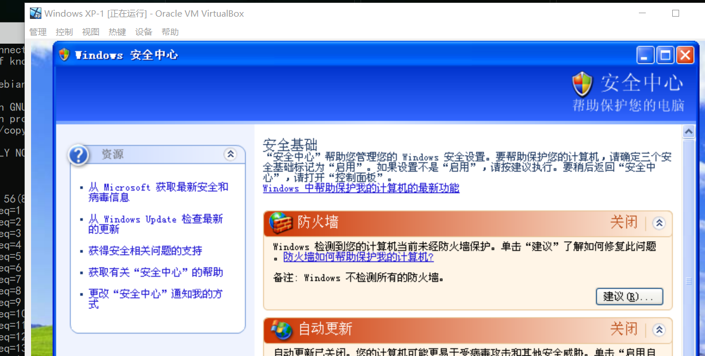

### 配置结果

intnet1:

intnet2:

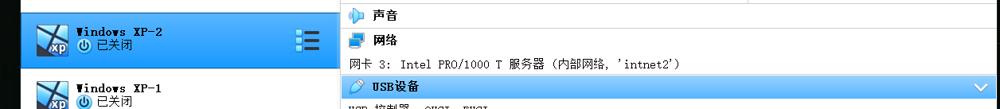

网关：

Attacker：

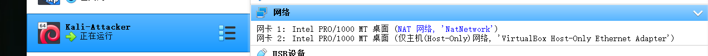

## 测试网络连通性（以intnet1为例）

### 各终端地址

Victim-XP-1 IP(172.16.111.109):

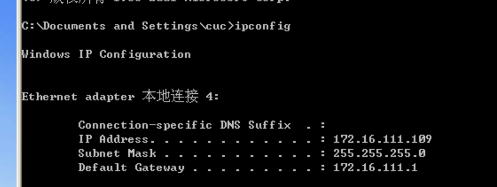

Victim-Kali-1 IP(172.16.111.150)：

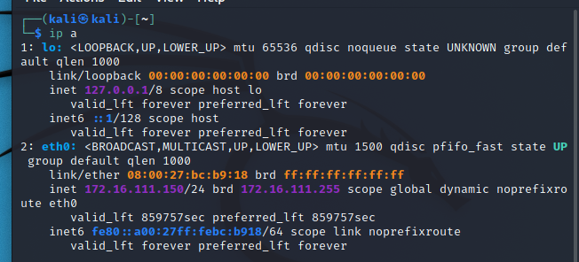

Gateway IP(172.16.111.1/172.16.222.1)：

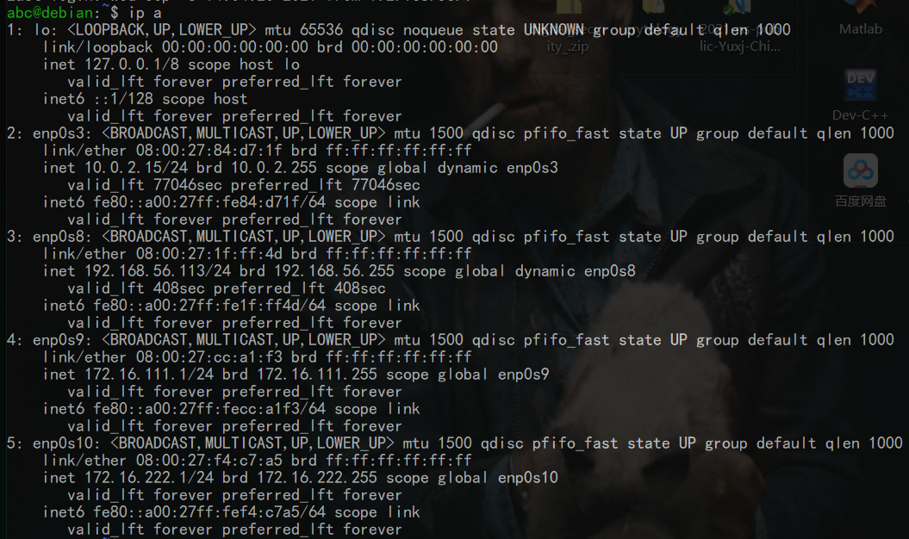

Attacker IP(10.0.2.15)：

### 测试结果

#### √ 靶机可以直接访问攻击者主机：

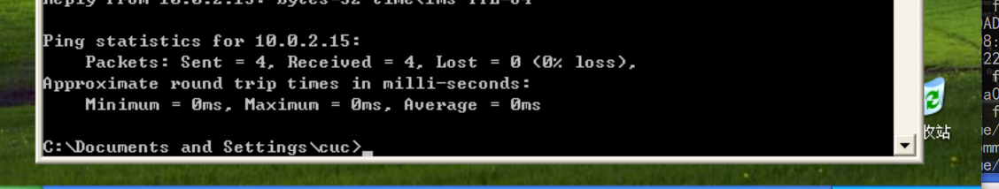

#### √ 攻击者主机无法直接访问靶机：

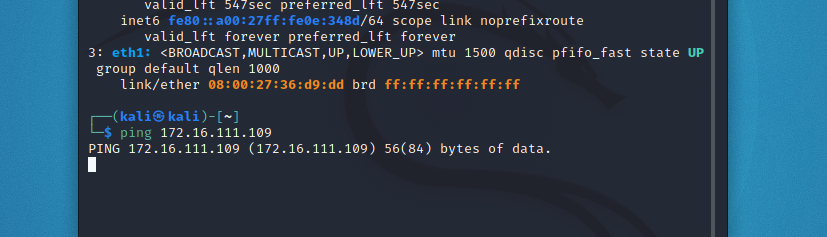

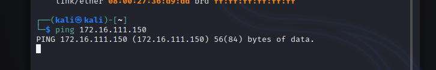

#### √ 网关可以直接访问攻击者主机和靶机

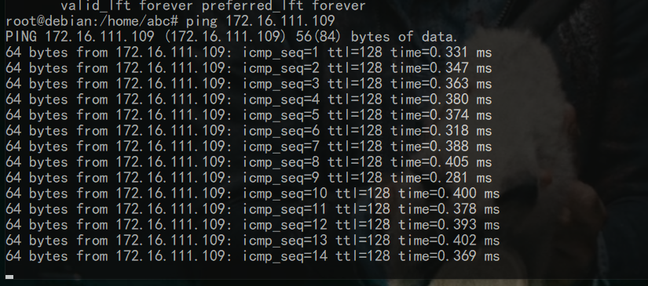

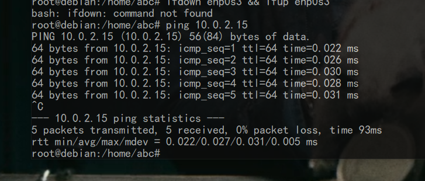

#### √ 靶机的所有对外上下行流量必须经过网关

XP-1制造流量：

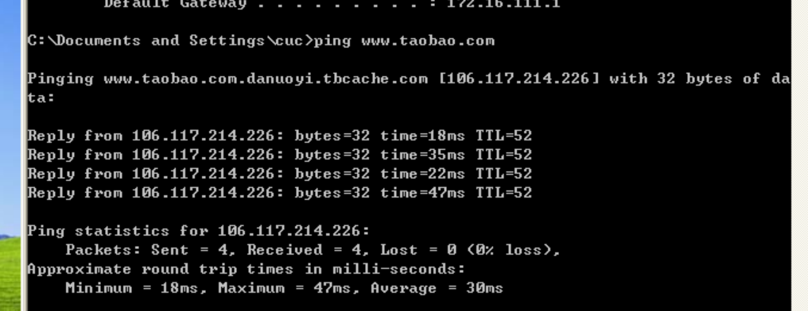

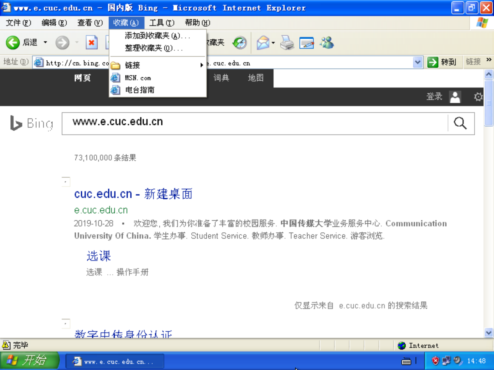

网关后台显示抓到332个数据包:

将数据包文件传输至服务器主机:

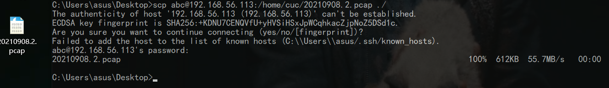

打开pcap文件可以看到刚刚ping淘宝的记录：

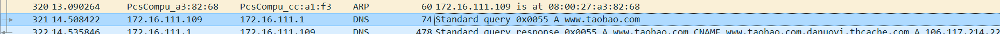

#### √ 所有节点均可以访问互联网

Attacker能连接百度：

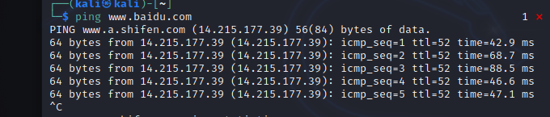

开启域名解析服务后可以ping得通cuc官网：

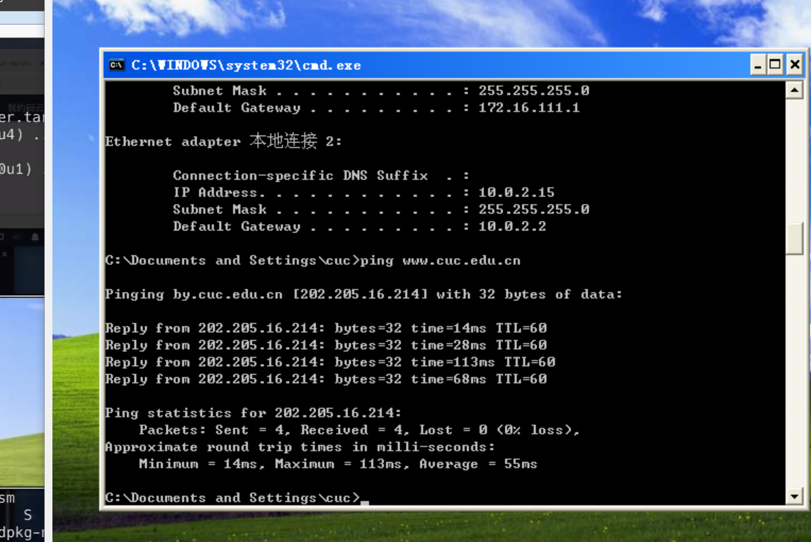

网关也能连接淘宝：

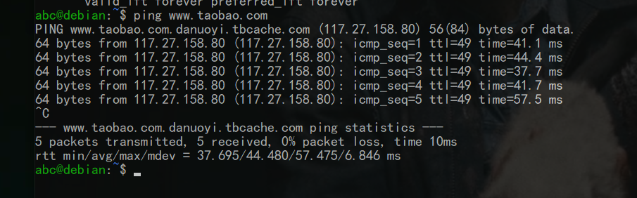

# 课后作业

以下行为分别破坏了CIA和AAA中哪一个属性或多个属性？

- 小明抄小强的作业

    —机密性

- 小明把小强的系统折腾死机了

    —可用性、认证

- 小明修改了小强的淘宝订单

    —完整性、认证

- 小明冒充小强的信用卡账单签名

    —完整性、可用性、认证、授权

- 小明把自己电脑的IP修改为小强电脑的IP，导致小强电脑无法上网

    —完整性、可用性、认证、授权、计费