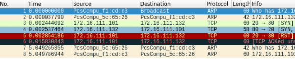
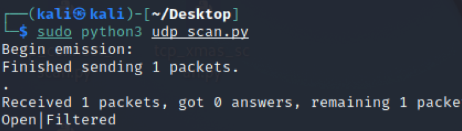

# 第五章实验-网络扫描、

## 实验目的

掌握网络扫描之端口状态探测的基本原理

## 实验环境

python+scapy

## 实验要求

禁止探测互联网上的 IP ，严格遵守网络安全相关法律法规

完成以下扫描技术的编程实现

- TCP connect scan

- TCP Xmas scan

- UDP scan

上述每种扫描技术的实现测试均需要测试端口状态为：开放、关闭 和 过滤 状态时的程序执行结果

提供每一次扫描测试的抓包结果并分析与课本中的扫描方法原理是否相符？如果不同，试分析原因；

在实验报告中详细说明实验网络环境拓扑、被测试 IP 的端口状态是如何模拟的

（可选）复刻 nmap 的上述扫描技术实现的命令行参数开关

## Scapy基础([代码参考](https://github.com/CUCCS/2020-ns-public-LyuLumos/tree/ch0x05/ch0x05#%E7%AB%AF%E5%8F%A3%E7%8A%B6%E6%80%81%E6%A8%A1%E6%8B%9F))

```py
# 导入模块
from scapy.all import *
# 查看包信息
pkt = IP(dst="")
ls(pkt)
pkt.show()
summary(pkt)
# 发送数据包
send(pkt)  # 发送第三层数据包，但不会受到返回的结果。
sr(pkt)  # 发送第三层数据包，返回两个结果，分别是接收到响应的数据包和未收到响应的数据包。
sr1(pkt)  # 发送第三层数据包，仅仅返回接收到响应的数据包。
sendp(pkt)  # 发送第二层数据包。
srp(pkt)  # 发送第二层数据包，并等待响应。
srp1(pkt)  # 发送第二层数据包，并返回响应的数据包
# 监听网卡
sniff(iface="wlan1",count=100,filter="tcp")
# 应用：简单的SYN端口扫描 （测试中）
pkt = IP("...")/TCP(dport=[n for n in range(22, 3389)], flags="S")
ans, uans = sr(pkt)
ans.summary() # flag为SA表示开放，RA表示关闭

```

## 实验思路

①TCP connect scan和TCP stealth scan先发送一个S，若有回应，且回应标识为RA，说明目标处于关闭状态；若有回应，且标识为SA，则目标处于开放状态。而后TCP connect scan回复RA，完成三次握手同时断开连接；TCP stealth scan回复R，不完成三次握手，直接取消建立连接

②TCP Xmas scan、TCP FIN scan和TCP null scan无三次握手过程，都是先发送一个包，TCP Xmas scan发送FPU、TCP FIN scan发送F、TCP null scan发送的包无flag，然后根据目标主机是否回复R来判断目标主机端口状态。

③UDP不使用网络连接协议，通过发送UDP+port得到的回复确定目标主机的状态，其中：no response / server responds to the client with a UDP packet为开放状态；ICMP error type 3 and code 3为关闭状态；no response / ICMP error type 3 and code 1,2,3,9,10,13为过滤状态


## 实验内容

### 网络拓扑


服务器主机网络信息


### TCP connect scan

- 运行脚本

```py
from scapy.all import *


def tcpconnect(dst_ip, dst_port, timeout=10):
    pkts = sr1(IP(dst=dst_ip)/TCP(dport=dst_port,flags="S"),timeout=timeout)
    if pkts is None:
        print("Filtered")
    elif(pkts.haslayer(TCP)):
        if(pkts.getlayer(TCP).flags == 0x12):  #Flags: 0x012 (SYN, ACK)
            send_rst = sr(IP(dst=dst_ip)/TCP(dport=dst_port,flags="AR"),timeout=timeout)
            print("Open")
        elif (pkts.getlayer(TCP).flags == 0x14):   #Flags: 0x014 (RST, ACK)
            print("Closed")

tcpconnect('172.16.111.132', 80)
```

- 开启状态

运行代码结果


抓包结果



- 关闭状态

运行代码结果


抓包结果


- 过滤状态

运行代码结果


抓包结果


### TCP Xmas scan

- 运行脚本

```py
#! /usr/bin/python
from scapy.all import *


def Xmasscan(dst_ip, dst_port, timeout=10):
    pkts = sr1(IP(dst=dst_ip)/TCP(dport=dst_port, flags="FPU"), timeout=10)
    if (pkts is None):
        print("Open|Filtered")
    elif(pkts.haslayer(TCP)):
        if(pkts.getlayer(TCP).flags == 0x14):
            print("Closed")
    elif(pkts.haslayer(ICMP)):
        if(int(pkts.getlayer(ICMP).type) == 3 and int(pkts.getlayer(ICMP).code) in [1, 2, 3, 9, 10, 13]):
            print("Filtered")


Xmasscan('172.16.111.132', 80)
```

- 开启状态

运行代码结果


抓包结果


- 关闭状态

运行代码结果


抓包结果


- 过滤状态

运行代码结果


抓包结果


### UDP scan

- 运行脚本

```py
from scapy.all import *


def udpscan(dst_ip, dst_port, dst_timeout=10):
    resp = sr1(IP(dst=dst_ip)/UDP(dport=dst_port), timeout=dst_timeout)
    if (resp is None):
        print("Open|Filtered")
    elif (resp.haslayer(UDP)):
        print("Open")
    elif(resp.haslayer(ICMP)):
        if(int(resp.getlayer(ICMP).type) == 3 and int(resp.getlayer(ICMP).code) == 3):
            print("Closed")
        elif(int(resp.getlayer(ICMP).type) == 3 and int(resp.getlayer(ICMP).code) in [1, 2, 9, 10, 13]):
            print("Filtered")
        elif(resp.haslayer(IP) and resp.getlayer(IP).proto == IP_PROTOS.udp):
            print("Open")


udpscan('172.16.111.132', 53)
```

- 开启状态

运行代码结果


抓包结果


- 关闭状态

运行代码结果


抓包结果


- 过滤状态

运行代码结果



抓包结果


