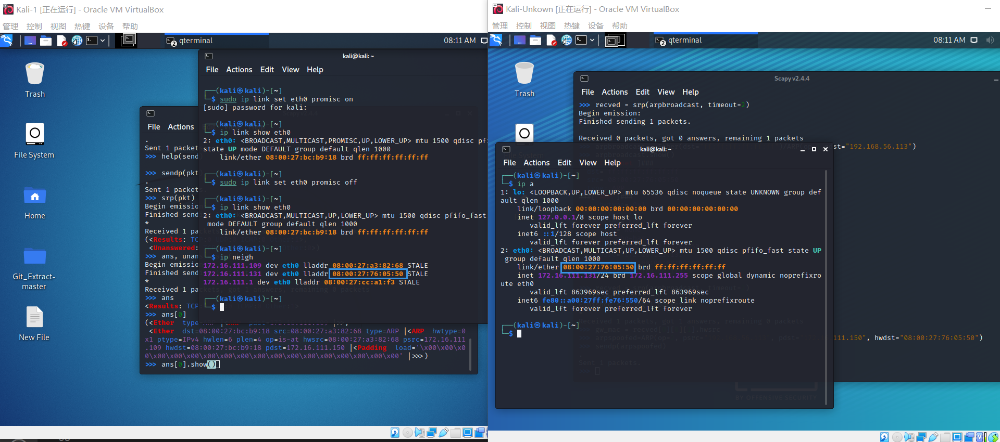

# 实验-网络监听

## 网络拓扑

各节点基本信息如下：

|身份|名称|地址|网卡|网卡MAC地址|
|---|---|---|---|---|
|网关|Debian10-Gateway|192.168.56.113|enp0s8|08:00:27:1f:ff:4d|
|攻击者|Kali-Unkown|172.16.111.131|eth0|08:00:27:76:05:50|
|受害者|Kali-1|172.16.111.150|eth0|08:00:27:bc:b9:18|

## 实验一  检测局域网中的异常终端

指令`ip link show enth0`，在受害者主机上检查混杂模式是否启用

输出结果中没有`PROMISC`，混杂模式未启用

攻击者主机上开启scapy

在root权限下使用scapy交互终端输入`pkt = promiscping("172.16.111.150")`

执行结果

可以看到，收到0个包，0个响应，剩余1个包，发送失败，是受害者主机混杂模式未开启的原因

返回受害者主机，输入指令`sudo ip link set promisc on`，手动开启混杂模式

攻击者主机再次发送ARP请求

对比发现，发送成功

关闭受害者主机混杂模式`sudo ip link set promisc off`

## 实验二  手工单步“毒化”目标主机的ARP缓存

攻击者主机上使用scapy获取局域网网关MAC地址

构造ARP请求包，指令`arpbroadcast = Ether(dst="ff:ff:ff:ff:ff:ff")/ARP(op=1, pdst="192.168.56.113")`

并查看报文详情

发送该请求

获取网关MAC地址，并伪造来自网关的ARP请求包

使用sendp指令发送该数据包

在受害者主机上使用`ip neigh`，可以看到，此时在受害者主机上查看 ARP 缓存会发现网关的 MAC 地址已被“替换”为攻击者主机的 MAC 地址

在攻击者主机上执行`restorepkt = ARP(op=2, psrc="192.168.56.113", hwsrc="08:00:27:1f:ff:4d", pdst="172.16.111.150", hwdst="08:00:27:bc:b9:18")`，再次伪造，尝试修改受害者ARP记录

受害者主机执行`ip neigh`，查看记录恢复

